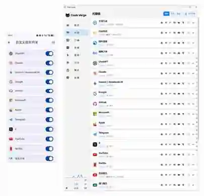

<div align="center">

# Clash Verge Rev & Bettbox Custom Script

**保留机场节点，统一重建策略组、分流规则与 DNS。换机场，不换使用习惯。**

[](./Clash-Verge-Rev-mihomoScript.js)
[-v1.18.8%2B-3ddc84)](./Bettbox-mihomoScript.js)
[](https://github.com/MetaCubeX/mihomo)

</div>

> [!IMPORTANT]
> 本仓库只提供 **Mihomo 配置覆写脚本**，不提供任何代理节点、机场订阅、网络接入或相关售卖服务。

## 项目简介

不同机场订阅通常自带不同的代理组、规则和 DNS。更换订阅后，使用习惯也可能随之改变。

本项目把“节点来源”和“配置逻辑”拆开：

> **订阅负责提供节点，脚本负责决定这些节点如何被组织和使用。**

脚本会保留订阅中的 `proxies` / `proxy-providers`，在此基础上统一重建主策略组、分流规则、Rule Providers 与 DNS。若节点或 provider 仍依赖原订阅中的旧策略组，只保留实际需要的依赖并自动隐藏。

因此，正常更换机场时无需修改脚本，也无需重新整理整套代理组。

### 主要特性

- **固定策略组结构**：`全球手动`、`自动选择`、`国外流量`、`漏网之鱼` + 独立服务组 + 地区聚合组。
- **AI 强制代理路径**：ChatGPT、Claude、Gemini / NotebookLM 不提供 `DIRECT`，也不经过可切换到直连的上级组。
- **常用服务独立分流**：Google、GitHub、Microsoft、Apple、Telegram、X、YouTube、Netflix；Clash Verge Rev 额外提供游戏平台分流。
- **地区聚合 + 自动测速**：香港、澳门、台湾、新加坡、韩国、日本、美国、欧洲、其他地区。
- **节点清洗与自然排序**：过滤公告、到期时间、剩余流量等伪节点；内联节点按地区 + 数字自然顺序排列。
- **国内外 DNS 分流**：国内业务使用国内 DNS，国外业务 DNS 随 `国外流量` 出口发送，并提供独立 `direct-nameserver`。
- **订阅依赖兼容**：保留仍被节点、provider、listener、tunnel、NTP 等引用的必要旧策略组。
- **Bettbox 可视化开关**：v1.18.8+ 可按服务或地区分组启用 / 关闭覆写。

## 快速开始

| 客户端 | 平台 | 脚本 | 说明 |
| --- | --- | --- | --- |
| **Clash Verge Rev** | Windows / macOS / Linux | [`Clash-Verge-Rev-mihomoScript.js`](./Clash-Verge-Rev-mihomoScript.js) | 桌面版；包含游戏平台分流，并补充 TUN / DNS 劫持缺失项 |
| **Bettbox v1.18.8+** | Android | [`Bettbox-mihomoScript.js`](./Bettbox-mihomoScript.js) | 支持 12 个可视化覆写开关；不接管 App 的 TUN / VPN 生命周期 |

> [!NOTE]
> 需要使用 **Mihomo 内核**，并要求客户端支持 `include-all`、`exclude-type`、Rule Providers、`.mrs` 等相关特性。

### Clash Verge Rev

1. 正常导入机场订阅。
2. 打开 `订阅` → **全局扩展脚本**。
3. 将 [`Clash-Verge-Rev-mihomoScript.js`](./Clash-Verge-Rev-mihomoScript.js) 全文复制进去并保存。**这里使用 Script，不是 Merge 覆写。**
4. 刷新订阅 / 重新加载配置。
5. 代理页出现 `全球手动`、`自动选择`、`国外流量`、`漏网之鱼`、服务组和地区聚合组，即表示脚本已执行。

### Bettbox

1. 正常导入机场订阅。
2. 在当前订阅的覆写设置中新增 JavaScript 脚本覆写。
3. 将 [`Bettbox-mihomoScript.js`](./Bettbox-mihomoScript.js) 全文复制保存并关联当前订阅。
4. 刷新订阅 / 重新应用配置。
5. Bettbox v1.18.8+ 会读取脚本顶部配置并显示 12 个可视化覆写开关。

> [!WARNING]
> 如果需要使用本脚本的 DNS 设计，请在 Bettbox 中关闭 **DNS 覆写**。Bettbox 的 DNS 覆写会在脚本执行后整体替换 `dns`，从而清空脚本生成的 `nameserver-policy`。

### Raw 地址

```text
https://raw.githubusercontent.com/hh1848/Clash-Verge-and-Bettbox-Custom-Script/main/Clash-Verge-Rev-mihomoScript.js
https://raw.githubusercontent.com/hh1848/Clash-Verge-and-Bettbox-Custom-Script/main/Bettbox-mihomoScript.js
```

> Raw 地址用于查看或同步脚本源码，**不是机场订阅地址**。脚本版本以对应文件头部的 `Version:` 为准。

## 效果预览

<p align="center">
  
</p>

## 策略组设计

### 基础组

| 代理组 | 类型 | 用途 |
| --- | --- | --- |
| `全球手动` | `select` | 手动选择全部有效节点；过滤伪节点并对内联节点进行地区 + 数字自然排序 |
| `自动选择` | `url-test` | 全节点自动测速，默认间隔 `600s`、容差 `80ms`、Lazy 模式 |
| `国外流量` | `select` | 一般国外流量的统一代理出口，不提供 `DIRECT` |
| `漏网之鱼` | `select` | 最终 `MATCH` 落点；默认使用 `国外流量`，保留手动 `DIRECT` 兜底 |

中国大陆流量不经过额外“国内直连”策略组：命中中国域名 / IP 规则后直接落到 `DIRECT`。

### AI 组

`ChatGPT` · `Claude` · `Gemini / NotebookLM`

AI 组只允许：

```text
自动选择
全球手动
各地区聚合组
```

它们既不包含 `DIRECT`，也不引用可以再切换到 `DIRECT` 的上级策略组，避免 AI 服务因持久化选择或上级组设置而间接直连。

### 常用国际服务

`Google` · `GitHub` · `Microsoft` · `Apple` · `Telegram` · `X` · `YouTube` · `Netflix`

这些组可选择：

```text
自动选择 / 全球手动 / 各地区聚合组 / DIRECT
```

`apple@cn` 与 `microsoft@cn` 会在对应通用服务规则之前直接 `DIRECT`。

### 游戏平台（仅 Clash Verge Rev）

`游戏平台` 覆盖 Steam、Epic Games、Battle.net / Blizzard、EA、Ubisoft、Riot 和 Xbox。组内同样提供自动选择、全球手动、地区聚合与 `DIRECT`，首次使用默认 `DIRECT`，避免游戏更新默认消耗代理流量。

`category-games@cn` 与 `category-game-platforms-download@cn` 会先于游戏平台通用规则直连。该功能主要基于域名规则，未知下载域名或直接连接 IP 不保证命中，下载前可在 Clash Verge Rev 的连接页面检查实际策略。

### 地区聚合

默认顺序：

```text
香港 → 澳门 → 台湾 → 新加坡 → 韩国 → 日本 → 美国 → 欧洲 → 其他
```

每个地区使用“可见聚合组 + 隐藏自动测速组”的两层结构：

```text
美国聚合
├── 美国自动        ← hidden: true，url-test
├── 美国节点 01
├── 美国节点 02
└── ...
```

这样主界面只保留一个地区入口，同时兼顾自动测速和手动选节点。

## 默认分流逻辑

规则自上而下匹配，命中即停止。整体思路是：**先处理需要精确优先级的服务，再处理中国 / 国外通用规则，最后由 IP 和 `MATCH` 兜底。**

| 优先级 | 流量类型 | 默认目标 |
| --- | --- | --- |
| 1 | LAN / private 域名 | `DIRECT` |
| 2 | NotebookLM、AI Studio、Gemini API 等精确域名 | `Gemini / NotebookLM` |
| 3 | OpenAI / Anthropic / Google Gemini | 对应 AI 组 |
| 4 | Apple CN / Microsoft CN；CVR 国内游戏平台与下载 CDN | `DIRECT` |
| 5 | CVR 七类游戏平台域名 | `游戏平台` |
| 6 | Google / GitHub / Microsoft / Apple / Telegram / X / YouTube / Netflix | 对应服务组 |
| 7 | 中国大陆域名 | `DIRECT` |
| 8 | `geolocation-!cn` | `国外流量` |
| 9 | private / Google / Telegram / Twitter / Netflix IP | 对应目标，`no-resolve` |
| 10 | China IP | `DIRECT` |
| 最后 | `MATCH` | `漏网之鱼` |

关键顺序包括：NotebookLM / Gemini 精确规则位于通用 Google 之前；Apple CN / Microsoft CN 位于对应通用服务规则之前；Clash Verge Rev 的 Xbox 规则位于通用 Microsoft 之前。

### Bettbox 服务开关回落

关闭某个服务后，对应策略组会从最终配置中移除，原本指向该组的域名 / IP 规则自动回落到 `国外流量`。Apple CN 和 Microsoft CN 的前置直连规则保持不变。

## 节点识别、过滤与排序

地区识别同时支持中文 / 繁体中文、emoji 国旗、英文国家或城市名称，以及常见机场代码和缩写。

同一节点名称如果同时命中多个地区，只归入优先级最高的地区，避免重复出现在多个地区组。

`全球手动`、`自动选择` 和地区组会过滤明显的信息型伪节点，例如：

```text
到期 / 过期 / 剩余流量 / 流量重置 / 套餐信息
官网 / 网址 / 订阅地址 / 公告 / 通知 / 教程 / 客服
Expire / Traffic Remaining / Website ...
```

过滤规则不会简单匹配“流量”二字，减少误伤“香港01｜不限流量”这类真实节点。

对 `config.proxies` 中已经展开的内联节点，`全球手动` 会按地区优先级排序，并在同一区域内使用纯 JavaScript 数字自然排序：

```text
香港1
香港2
香港10
```

不会被错误排成 `1 → 10 → 2`。

若订阅使用 `proxy-providers`，脚本通过 `use` 动态引用 provider。provider 内部节点顺序由 Mihomo 运行时管理，JavaScript 无法提前重排。

## Proxy Provider Health Check

脚本只补齐缺失配置，不无条件覆盖机场原有 health-check：

- `health-check.enable` 缺失时补为 `true`；如果机场显式设置为 `false`，保留原值并记录告警。
- URL 缺失时使用 `https://www.gstatic.com/generate_204`。
- `interval` 缺失或无效时使用 `600`。
- `lazy` 缺失时使用 `true`。
- 仅在使用默认 `generate_204` 且原配置没有声明状态码时补 `expected-status: 204`。
- 已有 URL、interval、timeout 等有效配置保持不变。

这样既能让 provider 节点更稳定地参与 `url-test`，也不会覆盖机场明确关闭健康检查或自定义测速参数的配置。

## Rule Providers

脚本自身规则集统一使用 `SKULL_*` 命名，来源于 [MetaCubeX/meta-rules-dat](https://github.com/MetaCubeX/meta-rules-dat)，采用 `.mrs` 格式，通过 jsDelivr 获取，默认更新间隔 `86400s`。

缓存路径：

```text
./ruleset/skull/
```

机场原有 `rule-providers` 会继续保留，以避免节点、provider 或其他配置仍引用它们时发生依赖断裂；脚本自己的主分流规则只引用 `SKULL_*` 系列。

每个 Rule Provider 都设置了 `16 MiB` 的 `size-limit`。正常 `.mrs` 文件远小于该值；如果触发限制，通常意味着上游响应异常或内容被中间设备替换。

规则集默认跟随 `meta-rules-dat` 的 `meta` 分支。若需要固定内容，可将脚本中的 `RULESET_REF` 改为固定 tag 或 commit SHA；修改后应清理一次规则集缓存。

## DNS 设计

两版脚本均使用 Fake-IP，并启用规则感知 DNS：

```yaml
enable: true
ipv6: false
prefer-h3: false
respect-rules: true
enhanced-mode: fake-ip
fake-ip-range: 198.18.0.1/16
fake-ip-filter-mode: blacklist
```

| 用途 | 上游 | 出口 |
| --- | --- | --- |
| Bootstrap | `223.5.5.5` / `119.29.29.29` | 本地 |
| 默认 / 国外域名 | Cloudflare DoH / Google DoH | `#国外流量` |
| 中国域名 / LAN / Apple CN / Microsoft CN / CVR 国内游戏规则 | AliDNS DoH / DNSPod DoH | `#DIRECT` |
| `direct-nameserver` | AliDNS DoH / DNSPod DoH | `DIRECT` |
| 代理节点域名 | AliDNS DoH / DNSPod DoH | `DIRECT` |

设计目的：国外业务 DNS 查询跟随代理出口，国内业务保持本地 GeoDNS / CDN 结果；代理节点域名单独直连解析，避免形成 `nameserver → 国外流量 → 节点域名解析` 的循环依赖。

Clash Verge Rev 额外加入 Windows / NTP 相关 Fake-IP 排除项，例如 `+.pool.ntp.org`、`+.msftconnecttest.com`、`+.msftncsi.com`。

## Bettbox 可视化覆写

Bettbox v1.18.8+ 会读取脚本顶部的 `ruleOptionsEnable` 与 `serviceConfigs`，当前提供 12 个开关：

```text
ChatGPT
Claude
Gemini / NotebookLM
Google
GitHub
Microsoft
Apple
Telegram
X
YouTube
Netflix
地区分组
```

| 操作 | 结果 |
| --- | --- |
| 关闭某服务 | 删除对应服务组，相关规则自动回落到 `国外流量` |
| 关闭 `地区分组` | 删除 9 个地区聚合组和 9 个隐藏自动测速组，同时清理其他组中的地区引用 |
| 保持默认 | 使用完整基础分流逻辑；游戏平台分流仍仅在 Clash Verge Rev 中提供 |

修改开关后需要重新执行覆写脚本，即刷新 / 重新应用对应订阅配置。

## 旧策略组依赖兼容

脚本不会无条件保留机场原代理组，只检查仍然存在的实际引用：

```text
节点 dialer-proxy
proxy-providers 的 proxy / override.dialer-proxy
Rule Providers 的 proxy
listeners
tunnels
NTP dialer-proxy
```

只有被引用的旧组及其传递依赖会保留，并统一设置 `hidden: true`。

如果发现旧组与节点重名、循环依赖或引用不存在目标，脚本会就地降级并写入日志，而不是直接抛错中断。无法安全恢复的引用会被切断并替换为 `REJECT`。

这里刻意不使用 `DIRECT` 作为未知引用的兜底，以避免配置异常时意外直连。日志以 `[SKULL]` 前缀输出，并在末尾汇总异常数量。

## 两版脚本差异

| 项目 | Clash Verge Rev | Bettbox |
| --- | --- | --- |
| 平台 | Windows / macOS / Linux | Android |
| 可视化服务开关 | 无 | 12 个 |
| 游戏平台独立分流 | 有 | 无 |
| 地区自动测速组 | 9 个，全部隐藏 | 9 个，全部隐藏；可随“地区分组”开关整体移除 |
| 节点自然排序 | 纯 JavaScript | 同一套纯 JavaScript，兼容 QuickJS |
| TUN | 仅在原配置上补缺失项，不强制开启 | 不覆写 `config.tun` |
| Fake-IP Filter | 基础项 + Windows / NTP 额外项 | 基础项 |
| 客户端二次改写 | 部分控制面字段可能在脚本后被客户端回写 | 多个核心字段会在脚本后按 App 设置重新写入 |

当前 main 的默认规模为：Clash Verge Rev **34 个脚本策略组 / 37 条规则 / 31 个 Rule Providers**；Bettbox 在全部开关启用时为 **33 / 28 / 22**。

若订阅存在旧策略组依赖，最终策略组数量可能更高；Bettbox 关闭开关后也会动态减少。

<details>
<summary><b>客户端在脚本之后还会改哪些值？</b></summary>

### Clash Verge Rev

脚本会设置常规增强项，例如 `tcp-concurrent: true`、`find-process-mode: strict`、`profile.store-selected: true`、`profile.store-fake-ip: true`。

TUN 只补缺失项：`stack: mixed`、`auto-route`、`auto-detect-interface`、`strict-route` 和 DNS hijack；不会强制开启 TUN。部分客户端控制面字段会在脚本执行后重新回写，因此最终值仍以客户端设置为准。

### Bettbox

Bettbox 会在脚本执行后按 App 设置重新写入 `mode`、顶层 `ipv6`、`unified-delay`、`tcp-concurrent`、`find-process-mode` 以及 TUN 相关字段。因此这些行为应通过 Bettbox 设置调整，而不是依赖脚本强制覆盖。

`profile.store-selected` / `store-fake-ip` 不属于这类无条件覆盖项，脚本写入可生效。

</details>

## 常见问题

<details>
<summary><b>配置里没有任何节点会怎样？</b></summary>

当 `proxies` 和 `proxy-providers` 同时为空时，脚本直接返回原配置，不执行覆写，避免订阅获取失败时破坏现有配置。

</details>

<details>
<summary><b>为什么最终策略组数量比默认值更多？</b></summary>

若原订阅中的节点、provider、listener、tunnel、NTP 或 Rule Provider 仍引用旧策略组，脚本会额外保留这些必要依赖并隐藏，因此最终数量可能增加。

</details>

<details>
<summary><b>为什么 provider 节点没有按“全球手动”的地区顺序排列？</b></summary>

脚本只能直接排序 `config.proxies` 中已经展开的内联节点。`proxy-providers` 中的节点由 Mihomo 运行时加载，内部顺序由内核管理。

</details>

<details>
<summary><b>为什么地区聚合组里还有一个“XX自动”？</b></summary>

这是设计行为。可见地区组是 `select` 聚合组，第一项是隐藏的 `url-test` 自动测速子组，后面才是该地区具体节点，一个入口即可同时支持自动和手动两种方式。

</details>

<details>
<summary><b>规则集首次加载失败怎么办？</b></summary>

Rule Providers 通过 jsDelivr 获取 `.mrs`。首次加载需要网络可达；加载失败时，未命中的流量会继续匹配后续规则或最终进入 `漏网之鱼`，规则集会按更新间隔再次尝试获取。

</details>

<details>
<summary><b>Bettbox 为什么没有使用脚本里的 DNS？</b></summary>

检查 App 是否开启了 **DNS 覆写**。开启后，Bettbox 会在脚本执行之后整体替换 `dns`，本脚本生成的 `nameserver-policy` 也会被清空。要使用本项目的 DNS 设计，应关闭 Bettbox DNS 覆写并重新应用配置。

</details>

<details>
<summary><b>Bettbox 开关修改后为什么没有立即变化？</b></summary>

开关只影响下一次脚本执行。修改后刷新 / 重新应用当前订阅，再检查最终生成的代理组和规则。

</details>

## 致谢

- [MetaCubeX/mihomo](https://github.com/MetaCubeX/mihomo) — Mihomo 内核。
- [MetaCubeX/meta-rules-dat](https://github.com/MetaCubeX/meta-rules-dat) — GeoSite / GeoIP `.mrs` 规则集。
- [Koolson/Qure](https://github.com/Koolson/Qure)、[0xWans/Qure](https://github.com/0xWans/Qure)、[lobehub/lobe-icons](https://github.com/lobehub/lobe-icons) — 图标资源。

## Disclaimer

本项目仅用于 Mihomo 配置研究、学习与个人网络配置管理。使用者应遵守所在国家或地区的法律法规、网络服务提供商及相关平台的服务条款，并自行判断第三方 Rule Provider 的可用性与安全性，自行承担配置修改造成的网络异常。

**本项目不提供任何代理节点、机场订阅或相关网络服务。**
